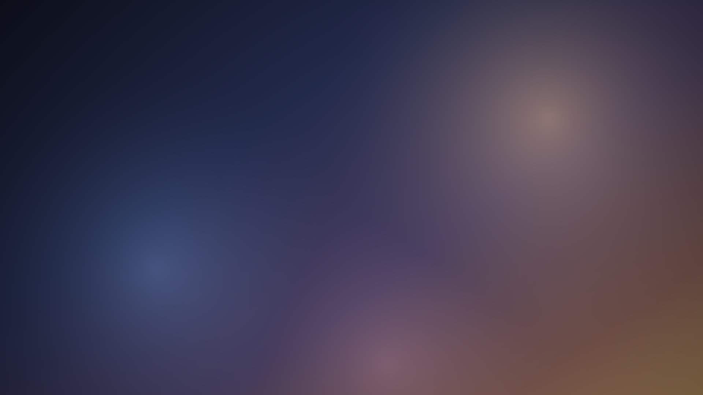

# dsh-ui-background

**把 DeepSeek Harness 桌面版的界面做成真正的「对背景图透明的 UI」**：整族表面填充改透明，
露出你自己的背景图，再用细边框把相邻面板重新区分开。

不只是换壁纸。透明的代价是这些表面不再遮住下层内容——正文滚到输入框下面、菜单压在对话上、
设置页盖在聊天记录上，下层文字都会从半透明表面里透上来，跟表面自己的字叠在一起。所以本项目
一并解决这件事：**对背景图透明，对下层文字不透明**。

不改 DSH 源码，不碰打包版，不安装任何包管理器依赖——只往 profile 补丁里插一个本地 Cordis 插件。



> 上图是仓库自带的原创占位图，由 [`tools/make-placeholder.py`](tools/make-placeholder.py) 程序合成，可自由分发。
> 换成你自己的图只需要一条命令。

---

## 它解决什么

桌面版设置里的「外观」只有 `light` / `dark` / `system` 三项、字号 12–17px，**没有图片背景选项，也没有自定义 CSS 入口**。

真正挡住背景的也不是某一层不透明底色，而是一整族设计 token：消息气泡、输入框卡片、代码块、侧栏导航底色、浮层……各用各的。这个项目把这些表面改透明，再用边框把相邻面板重新区分开。

**透明本身还带出第二个问题**：这些表面不透明时顺带遮住了下层内容，改成半透明（0.10）之后就不遮了。

- 正文滚到输入框下面时会从输入框里透上来；
- 输入框上方那条停靠卡片（任务 / 队列 / 目标）带 40px 背景模糊，背后的背景图被糊成一片；
- 下拉菜单、弹层、设置页、吸顶表头、通知条——**凡是压在别的内容之上的表面**，下层文字都会透上来。

样式表的第 5～7 段就是处理这件事的：**对背景图仍然透明，对下层文字不透明**。

## 环境要求

| | |
|---|---|
| DSH | 桌面版（`DSH_PROFILE=desktop`），且 profile 机制可用 |
| Python | 3.9+，带 Pillow（生成样式表用）、numpy（视觉验证台用） |
| Node.js | 18+（只用于跑自检，可选） |
| 浏览器 | Edge 或 Chrome（只用于视觉验证台的无头截图，可选） |

## 安装

**1. 克隆**

```bash
git clone https://github.com/Flowfangfei/dsh-ui-background.git
cd dsh-ui-background
```

**2. 生成样式表**

仓库自带的占位图可以直接用；换成你自己的图只要覆盖 `background/source.jpg`（该路径已 `.gitignore`）。

```bash
python background/make-background.py --source background/placeholder.jpg
# 或者：把你的图放到 background/source.jpg，然后
python background/make-background.py
```

它会产出 `background/background.css` —— 这个文件是生成物，已 gitignore。

**这一步也是视觉验证台的前提**：`verify/visual-check.py` 读的就是它（生成物不入库，全新克隆里不存在）。

**3. 挂载插件**

把下面这段追加到 `$DSH_HOME/profiles/desktop/cordis.patch.yml`（Windows 下 `$DSH_HOME` 默认是 `%USERPROFILE%\.dsh`），并把路径换成你克隆后的真实位置：

```yaml
- insert:
    - id: custom-ui-background
      name: "C:/path/to/dsh-ui-background/background/plugin.mjs"
```

也可参考 [`examples/cordis.patch.example.yml`](examples/cordis.patch.example.yml)。

两个要点：

- `name` 写成路径时，`dsh-app-boot` 的 `anchorInsertedPluginNames` 会把它锚定成 `file://` URL；Windows 路径用正斜杠更稳妥。
- **扩展名必须是 `.mjs`**。该目录没有 `package.json`，`.js` 会被 Node 当成 CommonJS 解析，而插件用的是 ESM 语法。

**4. 生效**

1. 先**刷新页面**。profile 配置默认热重载，而插件每次渲染 `index.html` 都重新读取 CSS，所以改样式通常不需要重启。
2. 没生效就**重启桌面版**。增删 `cordis.patch.yml` 里那一行必须重启。

**卸载**：删掉上面那段 `- insert:`，重启。

---

## 工作原理

### 为什么需要插件

宿主侧的 `webserver/index-inject` 事件是可用扩展点：每次渲染 `index.html` 时，插件往注入表里 push 一行 `{ kind: 'style', text }`，渲染器把它作为 `<style>` 插进 `<head>`。DSH 自带的 `ui-theme` 就是用这个钩子注入启动样式的——所以这条路是官方机制，不是 hack。

**每次 index 渲染都会重新收集注入表**，所以 `plugin.mjs` 每次现读磁盘上的 `background.css`：调外观只需改 CSS 再刷新，不必重启。

### 为什么靠 token 而不是类名

扫过 179 个含 `src` 的包，只有 **7 处**字面量底色，其中多数还是 `var(令牌, 兜底值)` 的兜底。也就是说**整个 UI 的表面几乎全靠设计 token 驱动**——覆盖 token 就能覆盖全界面，不必去猜哈希类名。

反过来，补边框必须用类名，但只匹配**类名结尾**（`[class$='_bubble']`）。实测构建后的类名保留了原始局部名（`.HLIF-a_frame`、`._0VSdMW_bubble` 两种格式都如此），所以结尾匹配既能命中，又不受包哈希前缀变化影响。

### 样式表的七段结构

1. **背景图**铺在 `<html>` 上（`cover` + `fixed`），`<body>` 底色置 `transparent`——否则启动阶段写下的不透明底色会盖住它。同一张图另存成自定义属性 `--dsh-ui-bg-image` 供后面几段复用（再写一遍 base64 会让样式表翻倍）。
2. **35 个表面填充 token 变半透明**（`rgba(基色, --fill)`），黑色块随之透出背景图。
3. **6 个边框 token 加粗**，让相邻透明面板仍能区分。其中 `border-l4` 同时驱动 `--dsw-elevation-stroke-color`，所以那些 `border: 0` + 描边的浮层也一并覆盖。
4. **18 类本来没有边框的表面补一条**，用 `[class$='_名字']:not([aria-hidden='true'])` 结尾匹配。
5. **输入框座位加一层遮挡**，把翻到输入框下面的正文挡掉，而座位对背景仍然全透明。
6. **输入框上方的停靠卡片去掉毛玻璃**，让卡片背后的背景图回到清晰。
7. **所有浮层（菜单、弹层、设置页、吸顶表头、通知条…）各补一层遮挡**：对背景依旧透明，对下层文字不透明。

另外两处不是「段」，是第 5、7 段共用的地基：

- **画布底色按区域折成一层**（`--dsh-ui-canvas-*`）——能算准「要补多少底色」的前提，见[画布底色为什么折成一层](#画布底色为什么折成一层)。
- **遮挡配方**（`--dsh-ui-occluder-*` / `--dsh-ui-cover`）——第 5、7 段都引用它，一处改、处处生效。

选择器一律用 `html body` / `html body[data-ds-dark-theme]` 提高权重压过运行时注入的样式表，再加 `!important` 兜底（第 5～7 段例外：它们只往座位的 `::before` 上加东西、只覆盖一个变量、或整体替换浮层自己的 `background`，都不动应用别的声明）。

---

## 透明之后：压在别的内容之上的表面

### 输入框座位：正文不再透出

应用的「输入遮掩」本来就是**座位自己那层渐隐**（`ConversationRoot.module.css` 的 `.composerSeat`）：

```css
background: linear-gradient(180deg, color-mix(in srgb, var(--dsw-alias-bg-base) 0%, transparent) 0px,
                                   var(--dsw-alias-bg-base) 36px);
```

底色不透明时它挡住翻到底下的正文。第 2 段把这个 token 改成 `rgba(基色, 0.10)` 之后，遮罩只剩一成不透明度，正文就整片透出来，和输入框里的字叠在一起。

**为什么只能硬切**：想让正文渐隐就得让遮罩带透明度，而遮罩一旦带透明度，背景图也会跟着淡掉——表面全透明时这两件事是同一件事。所以切在**座位自己的上边界**，也就是应用原本开始渐隐的那条线，边界位置和从前一样。

**怎么修**：给座位加一个铺满它的 `::before`，自下而上画三层：

| 层 | 内容 | 为什么不能少 |
|---|---|---|
| 3 | `var(--dsh-ui-bg-image)`，`cover` + `background-attachment: fixed` | 不透明 JPEG，正文就是被它挡住的 |
| 2 | 区域底色（会话区默认 2 层，Windows 标题栏布局 3 层） | 图片不透明，会盖住已经画好的祖先底色；不补回来座位那一带会比周围亮 |
| 1 | 座位自己那条 36px 渐隐带 | 同上，被图片盖住了 |

`background-attachment: fixed` 的定位区是视口，所以这张图与 `<html>` 上那张在同一视口坐标下对齐——座位画出来的就是背景本身，不是另加的一层色。这也是「输入框依旧对背景透明」的实现方式：它连底色都没加，只是把背景重画了一遍。

`::before` 用 `position: absolute; inset: 0; z-index: -1`：座位在应用里是 `position: sticky/absolute` + `z-index: 7`，本身即成层叠上下文，所以负层级正好落在**座位底色之上、输入卡片之下**，既不挤动座位里的 flex 布局，也不会吃掉点击。

**已知瑕疵：重采样差最多 8/255。** 座位那层用 `background-attachment: fixed` 重画时，Chromium 对它会**单独重采样一次**，于是和根元素自己画的那张相差最多 8/255（实测：通道差 >4 的像素占 0.17%，>8 的没有，放大 8 倍看是全黑）。不是算术错误——层数或 alpha 错了会差 20 以上。试过的几条路都被否掉，记在这里免得再走一遍：

| 做法 | 结果 |
|---|---|
| 视口大小的 `position: fixed` 元素 + `mask` 限制到座位那一带 | 确实逐像素相同，但它的横向范围是整个视口，会在座位那一带把**侧栏底部**也刷成中栏的底色（侧栏多一层 0.10） |
| 座位大小的盒子 + 手算 `cover` 几何（`max(100vw, 100vh * 宽高比)`） | 更差（峰值 22）。Chromium 按盒子的尺寸重新光栅化背景，盒子一小，采样就和根元素对不上了 |
| 视口大小的 fixed 元素 + `clip-path` 裁到座位那一带 | 更差（峰值 22）：`clip-path` 会把图层重新光栅化一遍 |

### 停靠卡片：不再糊背景

输入框上方那条「任务 / 队列 / 目标」卡片（`conversation.input.dock` 槽位）画的是 `--dsw-specific-menu`，并带 `backdrop-filter: var(--dsw-menu-backdrop-filter)`——主题里那是个 `blur(40px) saturate(150%)`。卡片盖住的背景图被整片糊掉，什么都看不清。

卡片在座位里，背后就是上一节那层不透明背景图，正文早就被挡住了，不必再靠模糊去糊文字。所以第 6 段只关掉模糊，卡片自身的底色照旧（与输入卡片一致，都是 0.10）：

```css
html body [data-slot='conversation.input.dock'] {
  --dsw-menu-backdrop-filter: none !important;
}
```

三个决定：

| 决定 | 原因 |
|---|---|
| 设变量，而不是直接写 `backdrop-filter: none` | 毛玻璃画在元素上还是伪元素上，各卡片不一样（`TodoPanel` 画在元素上，`QueueDock` 画在 `.panel::before` 上），变量靠继承一次盖住两种写法；而直接写 `!important` 会连「自己又重新声明了这个变量」的浮层一起盖掉 |
| 作用域只到停靠槽位的锚点 | 从输入框里弹出的菜单 / 浮层不在这个子树里。它们背后是正文，必须留着模糊才读得清——那层 0.10 底色单独扛不住正文 |
| 不去动 `--dsw-menu-backdrop-filter` 的全局定义 | 同上：菜单、浮层、侧栏面板都在读它 |

实测锐度（`verify/visual-check.py` 量的比值：矩形里的平均横向亮度梯度 ÷ 同一块矩形「卡片不画」时的裸背景锐度）：

| | 锐度 / 裸背景 |
|---|---|
| 改前（带 `blur(40px)`） | 0.09 |
| 改后 | 0.90 |

0.90 而不是 1.00，是因为卡片自己那层 0.10 底色把对比度按 0.9 缩了一次——和输入卡片完全一致。

### 所有浮层：一条配方，三处钩子

插件把 35 个表面 token 改成了 0.10。凡是**压在别的内容之上**的表面——下拉菜单、弹层、设置页、吸顶横幅、通知条——下面那层的正文都会透上来，跟它自己的字叠在一起。安装版 bundle 里这样的表面有 **19 处**（全量 CSS 扫描的结论，不是猜的）。

每个浮层补一层不透明的 `[它自己的底色][区域底色][背景图]`，也就是第 5 段那个配方。19 条规则只分三种写法，因为应用画底色就这三种：

| 写法 | 钩子 | 谁在用 |
|---|---|---|
| `.material` 子元素 | `[class$='_material']` | 所有走 primitives `MenuSurface` 的菜单 / 弹层（**≥15 个插件**共用：模型选择、命令面板、页签菜单、dock 菜单…）。它们自己不画底色，底色全在这个子元素上 |
| `:before` 材料层 | `:is([class$='_panel'], [class$='_menu'], [class$='_bar']):before` | queue dock、cordis 面板、子代理血缘菜单、目标栏、agent team 面板（5 处，写法完全一样） |
| 元素自身 `background` | 各自的类名结尾 | 其余大多数（后台任务菜单、统计弹层、上下文用量、日程选择、文档预览…） |

清单是**声明式**的，在 `background/make-background.py` 的 `OCCLUDED_SURFACES` 里，一条一行：`(选择器, 它自己的底色令牌, 区域)`。加一处新浮层就是加一行。

选择器一律用**类名结尾匹配 / data 属性 / `:is` / `:has`**，不写包哈希前缀——这条由 `verify-plugin.mjs` 的护栏 8 强制（它会拒绝任何形如 `.aSus8q_root` 的选择器）。

### 别给「容器」铺背景（一次真实事故）

按类名结尾匹配有个前提：**那个元素自己画底色**。有些元素长得像面板、其实只是**容器**——自己不画底色，靠隐藏子元素来收起，**盒子还在、还留着宽度**。给它铺一层不透明背景，就等于在它自己的盒子上糊一整块，把别的界面挡掉。

右侧栏面板就是这么写的（安装版 `0.1.5-alpha.1`）：

```css
.OUqwTW_panel { position: absolute; top: 0; bottom: 0; right: 0; pointer-events: none }
/* 隐藏发生在子元素上：容器自己既不收宽度、也不设 visibility */
.OUqwTW_panel [data-dockkit-host='dock'], … { transform: translateX(…); visibility: hidden }
```

于是 `[class$='_panel']` 命中它 → 给它铺上不透明背景 → **主对话区右侧整块被盖住、文字只剩一半**。

修法是给每条浮层规则加两道保险：

| 保险 | 挡住什么 |
|---|---|
| `:not([aria-hidden='true'])` / `:not([aria-hidden='true'] *)` | 自己或祖先声明了「这块藏着」的元素。收起的面板正是这么标的 |
| `:not([data-sidebar-right-panel])` | 右侧栏面板的属性版保险——它的隐藏全靠子元素，光看类名结尾跟它分不开 |

`:before` 那几条也照加，但保险要加在**元素**那一段上（`X:before:not(…)` 是无效选择器）。

验证台里放了一个「关掉的右侧栏面板」复刻件（容器、`aria-hidden`、`data-sidebar-right-panel`、保留宽度、隐藏子元素），跑两条**成对**的断言：

| 断言 | 内容 | 实测 |
|---|---|---|
| 反向 | 它照画与不画，两张图在它矩形里必须**落在噪声内** | 峰值 **0** |
| 自检 | 把两道保险去掉，同一块矩形**必须被盖住** | 峰值 **25~37**（随背景图变） |

第二条是关键：它证明第一条不是因为「测不出问题」才通过，而是保险真的在起作用——`visual-check.py` 会**现生成一份去掉保险的样式表**来跑它。

### 画布底色为什么折成一层

遮挡层要还原「这块表面背后的样子」，就必须知道背后叠了几层底色。插件原来让每层表面各叠一次 0.10，于是**层数取决于所在区域**：会话区 3 层、侧栏 2 层、中栏面板 2 层……浮层还要再按「它压在哪一区」分开算，规则会碎成一地。

所以先把每个区域的总量**折成一层**（n 层 `rgba(base, fill)` 顺序叠加等价于一层 `alpha = 1-(1-fill)^n`）：

| 区域 | 谁画的 | 层数 |
|---|---|---|
| `frame` | `AppFrame .frame` | 1 |
| `panel` | 上面 + `AppFrame .centerCol` | 1（Windows 标题栏布局 2） |
| `sidebar` | `.frame` + `.sidebarCol` | 2 |
| `center` | `.frame` +（Windows 才有 `.centerCol`）+ `ConversationRoot .root` | 2（Windows 3） |
| `modal` | 在 `center` 之上再压一层模态遮罩 `--dsw-alias-bg-mask-1` | — |

折成一层之后：**同一区域内的背景是常量**，任何浮层只要说明它在哪个区域，配方就唯一确定，再也不必数层数。代价只是折平与逐层叠加之间 ≤2/255 的取整差。

浮层的区域按**它压在哪一区**定，不是按它挂在 DOM 哪儿：

- 菜单 / 吸顶条挂在会话区 → `center`；挂侧栏里的另有一条 `:has(> [data-slot='sidebar'])` 规则 → `sidebar`（用结构选择器定位侧栏列，不猜哈希类名）。
- 浮层面板（统计、上下文用量、日期选择…）在中栏 → `panel`。
- 模态里的居中面板（设置页）背后还压着遮罩 → `modal`（含遮罩那一层，否则面板会比四周亮一块）。
- 全屏浮层（登录、引导、设置页外层）自己盖住一切 → 也用 `center`，这样它与里面的面板同色，看不出接缝。

⚠ 层数与区域划分是**数出来的常量**（安装版 `0.1.5-alpha.1`）。DSH 升级后若某个祖先多 / 少一层底色，那一带会亮或暗一层；`verify/visual-check.py` 会逐像素告警。

---

## ⚠ 关于背景图（重要）

**这个仓库刻意不包含任何第三方画稿。**

原因有三，都与"图片地址"有关：

1. **版权**：第三方画作即便只是拿来当壁纸，公开分发也可能侵权。仓库里的 `placeholder.jpg` 是程序合成的原创图，可以安全分发。
2. **体积**：一张 2800×1608 的照片约 600 KB，内联成 base64 后膨胀到 850 KB。把它提交上来等于把仓库撑大近 1 MB，而且**每改一次参数就产生一个全新 blob**，历史会被迅速撑爆。
3. **生成物不该入库**：`background.css` 内嵌了图片的 base64。提交它等于把图片提交两遍。它是可随时重建的生成物，已 gitignore。

所以流程是：**图由使用者自备，代码只带生成器**。把图放到 `background/source.jpg`（已 gitignore）即可。

`background/preview*.jpg` 和 `background/variants*.jpg` 是本地生成的观感预览，同样不入库。

### 为什么图片是内联进 CSS 的

因为这是免安装、免路由的最简做法。代价是 base64 膨胀约 33%，且内联内容不参与浏览器缓存——**每次刷新页面都会重新传输**。走 localhost 是瞬时的，但如果你把背景图换成大图又介意这个开销，可以让插件通过本地 HTTP 路由提供图片、CSS 里只写 `url("/xxx.jpg")` 引用：省掉 33% 膨胀，且图片能进缓存只传一次。代价是插件要多注册一条路由，属于新增的失败面。当前实现没走这条路。

---

## 参数

```bash
python background/make-background.py --help
```

| 参数 | 默认 | 含义 |
|---|---|---|
| `--source` | `background/source.jpg` | 源图路径，可指向任意位置 |
| `--fill` | `0.10` | 表面填充 alpha。`0` = 完全透明；越大面板越实、文字越好读 |
| `--border` | `0.22` | 边框/描边 alpha。越大发丝线越亮，但**也会让折叠容器的残线变明显**，别调太高 |
| `--blur` | `0` | 高斯模糊半径（px）。`0` = 保留原清晰度。若照片自己的建筑硬边被误读成 UI 框线，调到 2~3 |
| `--gamma` | `0.70` | 暗部提升：`<1` 抬阴影。`1.0` = 完全不改色调 |
| `--saturate` | `1.0` | 饱和度倍数 |
| `--position` | `center center` | CSS `background-position`，如 `70% center` 把画面右移 |
| `--quality` | `95` | JPEG 质量 |
| `--max-side` | `0` | 图片最长边上限；`0` = 不缩放，保留原始分辨率 |

**`--fill` 同时也是第 5、7 段要补回的底色量**，不用另外调参数：祖先底色与补回的层用的是同一个 token，`--fill` 改了它们一起跟着改；`--fill 0` 时两边都变成全透明，仍然一致。

### `--gamma` 是暗色背景图的关键

面板接近全透明后，**你看到的就是图片本身**：图片的暗部有多暗，界面就有多暗。一张夜景图中位亮度可能只有 30，而深色面板色是 `(21,21,23)`——两者几乎相等，所以调 `--fill` 救不回来：面板加得再多，也只是把暗部换成同样暗的色块。

`--gamma` 才是那个旋钮。gamma 0.70 能把 25 百分位亮度从 20 抬到 43、中位从 30 抬到 57，暗墙才从"死黑"变成看得出的纹理。判断标准：

- 暗部像"一块黑" → `--gamma` 往 0.6 走
- 整张图像蒙了层灰、发白 → `--gamma` 往 0.85~1.0 走

### 清晰度与"框线感"是一枚硬币的两面

`--blur 0` 最清晰，但照片自己的高对比边缘会原样透出来——在几乎全透明的面板下，它们很容易被看成 UI 画错的线。想要清晰就用 `0`，想让它像背景纹理就用 `2~3`。

怎么判断一条线到底是照片的还是 UI 的？把图转灰度、算**列/行平均亮度的一阶差分**找最强边缘，再按 `background-size: cover` 的缩放与偏移投影到屏幕坐标对照即可。本项目开发时就靠这个方法确认过两处"疑似 UI 框线"其实是照片里的建筑交界。

---

## 面板边框：命中了什么，刻意避开了什么

加边框的前提是"这块是一个面板，而且它是可见的"。有两类元素不满足，已在生成器里排除。

**A 类：几何上全宽/全高，但不是面板**——边框会画成一条没有语义的长线。

| 类名 | 几何属性 | 问题 |
|---|---|---|
| `_composerSeat` | `absolute; left:0; right:<scrollbar>; bottom:0` | 全宽，边框横贯整个内容列 |
| `_schema` / `_payload` | `min-height:100%` | 全高，画出竖长线 |
| `_turnRail` | 本身即 `width:2px` 的竖轨 | 画成双线 |
| `_fade` | 渐隐遮罩 | 画出硬边 |

**B 类：会被"塌缩成 0 尺寸"隐藏，或应用自己声明了 `border: none`**。
元素收成 0 宽高时那 1px 边框**照样渲染**，于是关闭面板后残留一条线；而 `border: none` 是代码库在明确表达"这里不要边框"，不该被 `!important` 盖掉。

| 类名 | 实测证据 | 问题 |
|---|---|---|
| `_panel` | `settings-plugins` 的 `.llfbtq_panel` 带 `width:0` | 可折叠预览面板，关闭后残线 |
| `_table` | `trajectory` 的 `.EJg6FW_table` 带 `width:0` | 同上 |
| `_overviewPreview` | `trajectory` 带 `height:0` | 同上 |
| `_runHeader` | `workflow-run` 带 `width:0` | 同上 |
| `_badge` | `cordis` 的 `._7pkzhq_badge` 明确写了 `border: none` | `!important` 会盖掉应用的意图 |

另外所有补边框选择器都带 `:not([aria-hidden='true'])`：有些组件用"保持盒子但收成 0 尺寸 + 标 `aria-hidden`"来隐藏，这条能挡住那类残线。

### 刻意不碰的 token（改了会坏功能，不只是观感）

| 令牌族 | 原因 |
|---|---|
| `--dsw-alias-bg-mask-*` | 弹窗/抽屉遮罩，透明后模态框与背景分不清。（第 7 段的 `modal` 配方会**引用**它来把遮罩那一层算进遮挡层，但不改它的值） |
| `--dsw-alias-button-primary-fill` / `-info-fill` / `-contrast-fill` | 强调按钮的实心填充，透明后主按钮消失 |
| `--dsw-alias-interactive-bg-*` | 悬停/激活反馈，本身是极淡叠加（.08/.14），不是黑块 |
| `--dsw-alias-bg-skeleton` | 加载骨架的动效底色 |
| `--dsw-alias-label-*`、`-link`、`-brand-*` | 前景/文字色 |
| `--dsw-alias-state-*` | 成功/错误/警告语义色 |
| `--dsw-alias-scrollbar-*` | 滚动条 |

另外补定义了 `--dsw-alias-fill-tertiary: transparent`：设计系统里没有这个 token，但 `FileCard` 引用了它，原本会走硬编码兜底 `rgba(0,0,0,0.08)`；定义它就绕开了兜底。

---

## 自检

```bash
# background/background.css 是生成物、不入库：全新克隆里先跑一次生成器，
# 否则前两条自检会提示找不到样式表，视觉验证台也读不到它。
python background/make-background.py --source background/placeholder.jpg

node verify/verify-plugin.mjs     # 离线：插件契约 + 样式表结构
node verify/verify-patch.mjs      # 离线：profile 补丁解析
python verify/visual-check.py     # 无头浏览器逐像素比对（需要 Edge 或 Chrome）
```

`verify-plugin.mjs` 模拟 Cordis 宿主，共 **37 项断言，分八组**：

- **插件契约**：导出 `apply()` / 插件名、只注册 `webserver/index-inject`、注入行结构、CSS 缺失时优雅降级。
- **护栏 1**：全部表面 token 必须被覆盖（漏一个就有一块黑）。
- **护栏 2**：**不得**覆盖任何禁止的 token 族——上表逐条对应，含原因。这条防的是"改错一族令牌把功能弄坏"。
- **护栏 3~4**：边框 token 全部加粗、未定义令牌被补定义。
- **护栏 5~6**：补边框用结尾匹配且**未命中任何会留下错线的元素**；座位遮挡层是浅 / 深两条规则、绝对定位铺满、负层级、不吃点击、用会话区配方，并且不再按平台分叉。
- **护栏 7**：去毛玻璃的作用域是停靠槽位、把 `--dsw-menu-backdrop-filter` 覆盖成 `none !important`，且全表不出现 blur 型的 `backdrop-filter` 声明。
- **护栏 8**：浮层清单逐条验——区域合法、选择器不含哈希类名、把自己的底色画回来了、用了正确区域的配方、带 `!important`、关掉了自己的毛玻璃，并带上「自己或祖先藏着就别铺」的两道保险。

期望的 token 清单与浮层清单都是**从 `make-background.py` 解析出来的**，不是在 JS 里另抄一份——抄一份必然漂移，护栏就废了。

`verify-patch.mjs` 用桌面版自己的 `readProfilePatches` 校验你的 `cordis.patch.yml`：补丁能通过 schema、存在插件行、`name` 被正确锚定成 `file://`、目标文件存在且可 import。所有路径从 `$DSH_HOME` 推导，可加参数指定 profile：

```bash
node verify/verify-patch.mjs desktop
DSH_HOME=/path/to/.dsh node verify/verify-patch.mjs
```

### 视觉验证台

桌面版界面要求启动令牌（直接请求返回 401，令牌只存在于启动进程内存中），所以**进程外抓不到渲染后的页面**。`verify/visual-check.py` 换了个做法：它不连 DSH，而是把安装版 bundle 里 composer 那条 DOM 链**逐条抄进** `verify/visual-fixture.html`（容器链与其合成顺序、停靠卡片那层毛玻璃、三种写法的浮层各一个、一个「关掉的右侧栏面板」复刻件），用无头 Edge / Chrome 渲染，再逐像素比对。

跑 **11 条断言**：

| 断言 | 比什么 | 要求 |
|---|---|---|
| 有牙 | 改前：正文画 / 不画 | 必须差很多，否则验证台根本看不见这个问题 |
| 精确 | 改后：正文画 / 不画 | 落在抗锯齿噪声内（峰值 ≤8）——正文确实被挡住了 |
| 精确 | 改后：滚动 0 / 滚动 900 | 落在抗锯齿噪声内——座位画的是背景，不跟正文滚 |
| 容差 | 改后（全画）/ 改前（正文不画），停靠卡片那一行除外 | 落在重采样容差内（峰值 ≤12）——背景观感没变 |
| 前提 | 停靠卡片那块矩形上的裸背景锐度 | 必须可测（否则「发糊」与「不糊」都无从判断） |
| 有牙 | 改前：停靠卡片遮住的背景锐度 | 必须明显发糊 |
| 比值 | 改后：停靠卡片遮住的背景锐度 | 必须回到裸背景的水平——毛玻璃没了 |
| 有牙 | 改前：三个浮层矩形里有没有透字 | 必须看得见透字（实测 95 / 21 / 106） |
| 精确 | 改后：三个浮层矩形里有没有透字 | 落在抗锯齿噪声内（实测全 0）——三类写法都挡住了下层文字 |
| 反向 | 关掉的右侧栏面板：照画与不画 | 落在抗锯齿噪声内——没给容器铺背景 |
| 自检 | 去掉两道保险后同一块矩形 | 必须被盖住（实测 25~37，随背景图变）——证明上一条不是测不出问题 |

表里「落在抗锯齿噪声内」= 峰值不超过 `AA_TOLERANCE`（8）：这几条比的是**两次独立渲染**，文字抗锯齿会在 subpixel 与 grayscale 之间跳，背景越饱和越明显。要抓的问题都在 20 以上（漏字 100+、给容器铺背景 25~37），所以这个门限压得住噪声、也放不过问题。换背景图后若某条开始抖，先往 `?hide=` 里加一块文字——比对面里没有文字，抖动就没了。

**基准样式表**：脚本优先取 git 里**改动前**那一版 `background.css`（`--prev <ref>` 指定，默认引用是开发仓库里的一个标签）；取不到时它自动**由当前样式表切掉第 5～7 段合成一份**基准——公开仓库不入库生成样式表，任何提交里都没有它，所以全新克隆里直接跑即可。脚本还会挡住「拿改后当基准」这种自欺：基准里出现座位遮挡层的标记就直接报错退出。

`?hide=` 参数可以只让某一块不画——`transcript` / `dock` / `docktext` / `surfacetext` / `closedpanel`——用来做「照画 / 不画」的 A/B。其中浮层自己的文字会在比对前被藏掉（`surfacetext`）：它压在照片的饱和区域上时，字体抗锯齿会在两次渲染之间抖动（同一组参数跑两遍，字形像素峰值就能差 132），而矩形里其余像素是稳的。

截图与差分图留在 `verify/.tmp/`（不进版本库）：`band-*.png` 是座位那一带，`dock-*.png` 是停靠卡片那块矩形（裸背景 / 改前发糊 / 改后清晰），`diff-*.png` 是与基准的差分、放大 8 倍。

---

## 已知限制

- **渲染结果只能在验证台里验证，不等于真机验证**。桌面版界面要求启动令牌（直接请求会返回 401，令牌只存在于启动进程内存中），进程外抓不到真实页面。`verify/visual-check.py` 用一份**复刻的 DOM 快照**（`verify/visual-fixture.html`，抄自安装版 `0.1.5-alpha.1`）在无头浏览器里逐像素比对，能覆盖遮挡、背景观感与去毛玻璃，但那是一份快照、不是活引用：DSH 升级后若这条链变了（某个祖先多 / 少一层底色、座位不再是定位元素），要回来同步，否则验证台会替一份过期的结构背书。
- **座位那一带的背景图与根元素自己画的相差最多 8/255**（重采样路径不同，成因与被否掉的替代路线见上）。
- **层数与区域划分是数出来的常量**（会话区默认 2 层、Windows 标题栏 3 层）。DSH 升级后这条链若变化，那一带会亮或暗一层 0.10；`verify/visual-check.py` 会失败并提示。
- **浮层清单覆盖 19 处，但不是"一切"**。按位置明确排除的：tooltip（与聊天气泡共用类名结尾、底色 token 不同，写错会把气泡一起改掉）、HoverCard、图片查看器的关闭按钮与文档预览缩放条这类**盖在图片上而不是正文上的小控件**、以及本来就该压暗的遮罩。它们要么太小，要么透出来的不是正文。真看到哪一块透字，往 `OCCLUDED_SURFACES` 加一行即可。
- **浮层清单假定"命中即表面"**：`[class$='_panel']` 这类结尾匹配要求那个元素**自己画底色**。安装版里"像表面、其实只是容器"的元素已靠两道保险排除（见[别给「容器」铺背景](#别给容器铺背景一次真实事故)）。DSH 升级后若冒出新的这类容器，症状是**主界面被一整块盖住**；修法是把它加进 `with_hidden_guard` 的排除条件，并在验证台里补一个复刻件。
- **去毛玻璃只覆盖停靠卡片与清单里的浮层**。第 7 段逐条关掉被遮挡浮层的模糊，没进清单的浮层照旧保留模糊——它们背后是正文，去掉模糊后那层 0.10 底色扛不住文字。哪一块想一并去掉，先确认它背后也有不透明的遮挡。
- **折叠残线无法完全穷尽**。加粗边框 token 会影响应用已有的每一条边框，其中难免有属于可折叠容器的，而编译后的类名里没有稳定的"已折叠"标记可供选择器判断。已按实测证据剔除已知的 5 个（B 类），并把 `--border` 压到 0.22。
- **补边框会强制 `border: 1px solid`**。若某元素没设 `box-sizing: border-box`，其尺寸会增 2px。实测影响可忽略。
- **18 类补边框里 11 类属轨迹视图**（`trajectory`）。该视图观感异常时单独删掉对应名字即可，不影响主聊天界面。
- **DSH 升级会让部分选择器失效**。类名若改名，边框那段的表现是"少了一条边框"，浮层那段的表现是"那一块又透出下层文字了"，都不会坏布局。
- **清单里的底色 token 写得不完全对应也不影响观感**——第 2 段把 35 个表面 token 全改成了同一个值；保留各自的真实 token 是为了将来若把它们区分开时仍然正确。
- **`--position` 用的是 CSS `cover` 语义**：只有图片比窗口更"宽"时才会发生横向裁切，此时改横向值才有效果。

## License

[MIT](LICENSE)。仓库自带的 `placeholder.jpg` 由本仓库脚本合成，同样以 MIT 分发；使用者自备的背景图版权归各自作者。
