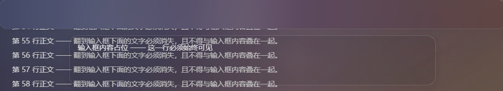
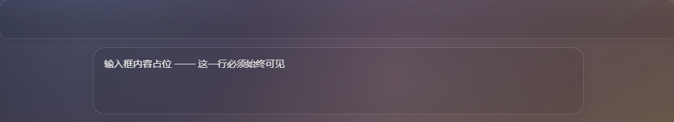

# dsh-ui-background

给 DeepSeek Harness（DSH）桌面界面加上图片背景、半透明面板和细边框，并在输入区及已列出的浮层下挡住正文，减少文字重叠。

使用者可以生成样式并挂载本地 Cordis 插件；维护者可以用离线夹具检查遮挡、清晰度与选择器。生成器需要 Python 和 Pillow，插件通过 CSS 改变外观，不修改 DSH 源码，也不向 DSH 安装新的 npm 包。

[安装](#安装) · [调参](#换图与调参) · [验证](#验证与维护) · [设计记录](docs/design.md) · [MIT 许可](LICENSE)

最后审核：2026-10-03。当前视觉测试与演示基于离线夹具，实际 DSH 桌面界面的显示验证尚未完成。[具体环境与结果](docs/validation-2026-10-03.md)。

## 演示：输入框下方不再透字

以下两张图是 **1000 × 800 离线测试夹具的输入区裁剪**，使用仓库自带的[程序合成占位图](background/placeholder.jpg)。它们不是实际 DSH 桌面截图。

**关闭遮挡与去毛玻璃规则时**：滚动正文透入输入区，上方停靠卡片模糊背景。



[查看原尺寸](docs/assets/fixture-before-input.png)。

**使用当前生成样式时**：相同内容、相同滚动位置，正文被挡住，停靠卡片下的背景恢复清晰。



[查看原尺寸](docs/assets/fixture-after-input.png)。

对照基准是当前透明主题移除第 5～7 段规则后的效果，不能用作 DSH 原始主题的对照。夹具来源、截图参数和实际界面拍摄要求见[测试与截图](docs/testing.md)。

## 环境与兼容范围

| 项目 | 要求 |
| --- | --- |
| DSH | 可编辑的 `desktop` profile，支持本地 Cordis 插件和 `webserver/index-inject` |
| Git | 用于克隆仓库 |
| Python | **3.10+**；生成器使用 `Path.write_text(..., newline=...)` |
| Pillow | 生成图片和样式所需；下方提供安装命令 |
| numpy、Edge / Chrome | 可选，仅用于离线视觉测试；numpy 也用于重新生成占位图 |
| Node.js | 可选，用于 JS 自检；使用 DSH 所要求的版本，当前检查使用 24.12.0 |

夹具记录的抄录版本是安装版 `0.1.5-alpha.1`。本次补丁解析使用安装版 `0.1.6-alpha.2` 的解析器与共享 `profiles/node_modules` 布局。`verify-patch.mjs` 依赖导出的 `readProfilePatches`，不能据此推定其他版本或独立 profile 布局受支持。

## 安装

以下以 Windows PowerShell 为例。先确认 DSH 桌面版已能正常启动，并确认正在使用的 `DSH_HOME` 和 profile。

### 1. 克隆并安装生成器依赖

```powershell
git clone https://github.com/Flowfangfei/dsh-ui-background.git
cd dsh-ui-background
python --version
python -m venv .venv
.\.venv\Scripts\python.exe -m pip install Pillow
```

`python --version` 应为 3.10 或更新版本。后面的命令直接调用虚拟环境，无需更改 PowerShell 执行策略。其他系统可改用 `.venv/bin/python`。

### 2. 先用占位图生成样式

```powershell
.\.venv\Scripts\python.exe background/make-background.py --source background/placeholder.jpg
```

成功后产生 `background/background.css`，终端输出包含以下条目：

```text
样式表         background.css  122 KB
表面透明       35 个 token @ alpha 0.1
浮层挡文字     19 条规则（19 个选择器，按区域补回底色）
```

体积随图片和参数变化。CSS 内嵌图片，已被 Git 忽略；先保留占位图，确认挂载有效后再换成自己的图片。

### 3. 向 desktop profile 插入插件

先备份已有的 `$DSH_HOME/profiles/desktop/cordis.patch.yml`。未自定义 `DSH_HOME` 时，Windows 默认路径为 `%USERPROFILE%/.dsh/profiles/desktop/cordis.patch.yml`。

在仓库目录运行下列命令，取得要填写的插件绝对路径：

```powershell
(Resolve-Path background/plugin.mjs).Path.Replace('\', '/')
```

将以下条目加入补丁的顶层 YAML 数组；`name` 换成上一步输出的真实路径。文件不存在时可以创建。已有 `insert` 列表时，也可以只向该列表添加这个条目，避免重复 ID。

```yaml
- insert:
    - id: custom-ui-background
      name: "C:/path/to/dsh-ui-background/background/plugin.mjs"
```

[完整条目示例](examples/cordis.patch.example.yml)。使用 `.mjs` 扩展名和正斜杠路径；宿主会将本地路径锚定成 `file://` URL。

### 4. 重启并确认效果

首次挂载后**重启 DSH 桌面版**。预期看到占位背景、半透明面板与细边框。使用一段无私人信息的长文本滚动到输入框下，再打开菜单，检查正文是否与输入框或菜单文字重叠。

插件已经挂载时，重新生成 CSS 后刷新页面会重新读取样式；若当前桌面版未重新请求 `index.html`，重启再确认。下方自检通过只能证明其各自的验证范围。

### 卸载

从补丁中删除 **ID 为 `custom-ui-background` 的那个条目**，重启 DSH。保留同一 `insert` 列表中的其他插件；只有列表已空时才删除它的 `insert` 节点。需要撤销整个文件的改动时，使用安装前的备份。

## 换图与调参

将自己的图片放到被 Git 忽略的 `background/source.jpg`，然后运行：

```powershell
.\.venv\Scripts\python.exe background/make-background.py
# 面板更实、边框更亮
.\.venv\Scripts\python.exe background/make-background.py --fill 0.18 --border 0.40
# 保留原图色调，并限制最长边以缩小内联 CSS
.\.venv\Scripts\python.exe background/make-background.py --gamma 1.0 --max-side 1920
```

生成后刷新页面；有关模糊、暗部提升和边框残线的取舍见[设计记录](docs/design.md#参数)。

| 参数 | 默认值 | 用途 |
| --- | --- | --- |
| `--source` | `background/source.jpg` | 源图路径，也可指定其他位置 |
| `--fill` | `0.10` | 表面填充 alpha；越大面板越实 |
| `--border` | `0.22` | 边框 alpha；过高可能放大折叠残线 |
| `--blur` | `0` | 高斯模糊半径，单位 px |
| `--gamma` | `0.70` | 小于 1 提升暗部；1 保留原色调 |
| `--saturate` | `1.0` | 饱和度倍数 |
| `--position` | `center center` | CSS `background-position`，例如 `"70% center"` |
| `--quality` | `95` | JPEG 质量，1～100 |
| `--max-side` | `0` | 最长边上限；0 不缩放 |

个人图片及其预览、内嵌图片的生成 CSS 不应提交。自备图片的分发权限取决于原图许可；仓库只附带由[本仓库脚本](tools/make-placeholder.py)合成的占位图。

## 验证与维护

在生成 `background.css` 后运行：

```powershell
node verify/verify-plugin.mjs
.\.venv\Scripts\python.exe -m pip install numpy
.\.venv\Scripts\python.exe verify/visual-check.py
# 可选：检查当前 DSH_HOME 下的实际 profile 补丁
node verify/verify-patch.mjs desktop
```

| 检查 | 范围 | 本次结果 |
| --- | --- | --- |
| `verify-plugin.mjs` | 模拟宿主、CSS 结构、完整解析当前 19 条浮层规则 | 37 项通过 |
| `visual-check.py` | 固定夹具内的遮挡、重采样、毛玻璃与隐藏容器 | 11 项通过 |
| `verify-patch.mjs` | DSH 解析器接受补丁、路径可导入、导出 `apply()` | 隔离 profile 6 项通过；未检查使用者的配置 |

自定义 home 时，先在 PowerShell 设置 `$env:DSH_HOME = 'D:/path/to/.dsh'`，再运行补丁检查。文件布局、解析器导出或实际界面不符时，查[排错与测试范围](docs/testing.md)。

**DSH 升级不会自动使离线测试失败。** 脚本不读取新安装的 DSH；需要维护者对照新的 DOM/CSS，更新 `visual-fixture.html`、`visual-fixture.css` 和生成器清单，重新测试，再检查真实界面。

维护者入口：

- [设计记录](docs/design.md)：七段样式、遮挡配方、区域层数、排除的边框与历史事故。
- [测试与截图](docs/testing.md)：断言、基准、重现命令、应该拍什么及如何拍。
- [2026-10-03 验证记录](docs/validation-2026-10-03.md)：已执行的检查及未验证部分。
- [生成器](background/make-background.py)、[插件](background/plugin.mjs)、[参数预览工具](background/preview-variants.py)。

## 已知限制

- 当前浮层清单有 19 条规则。tooltip、HoverCard、图片上的小控件等未全部覆盖；新增浮层要先确认它自己画底色，再加入清单。
- 区域底色层数与局部类名结尾来自固定版本；升级可能使遮挡失效，或误给容器铺背景。隐藏容器事故与防护见[设计记录](docs/design.md#别给容器铺背景一次真实事故)。
- 背景重画存在 Chromium 重采样差异；当前测试允许通道峰值 12/255，不能承诺所有机器逐像素一致。
- 边框覆盖可能影响尺寸或留下折叠残线，轨迹视图需要单独检查；详情见[边框选择](docs/design.md#面板边框命中了什么刻意避开了什么)。
- 图片内联会增加 CSS 体积，刷新会重新传输。`cover` 横向没有裁切余量时，调整横向 `--position` 不会产生移动。

## 许可与来源

本项目代码、原创占位图按 [MIT](LICENSE) 分发。离线夹具包含从 DSH 安装版抄录的样式声明，保留 `Copyright (c) 2026 DeepSeek` 和[上游完整 MIT 许可](docs/licenses/deepseek-harness-MIT.txt)；范围与固定来源见[第三方声明](THIRD_PARTY_NOTICES.md)。
