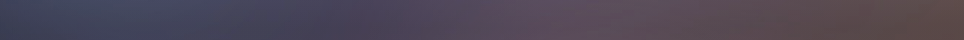

# 测试、排错与截图

[返回 README](../README.md) · [设计记录](design.md) · [本次验证结果](validation-2026-10-03.md)

最后审核：2026-10-03。本文区分离线夹具测试、profile 解析与实际界面检查。

## 从全新克隆运行

在仓库根目录执行；Python 3.10+、Node 及已安装的 Edge / Chrome 是前提。

```powershell
python -m venv .venv
.\.venv\Scripts\python.exe -m pip install Pillow numpy
.\.venv\Scripts\python.exe background/make-background.py --source background/placeholder.jpg
node verify/verify-plugin.mjs
.\.venv\Scripts\python.exe verify/visual-check.py
```

需要选择浏览器时：

```powershell
.\.venv\Scripts\python.exe verify/visual-check.py --browser 'C:/Program Files/Google/Chrome/Application/chrome.exe'
```

生成 CSS 是检查的前提，CSS 不在 Git 中。缺少图片时，明确使用占位图或提供 `--source`。

## 插件与样式结构

`verify-plugin.mjs` 模拟 Cordis 宿主，当前有 37 项检查：

| 组 | 检查内容 |
| --- | --- |
| 插件契约 | `apply()`、名称、事件、注入结构、样式文件缺失时的告警与降级 |
| 表面 token | 35 个填充覆盖，不覆盖遮罩、强调按钮、交互反馈、前景等禁改族 |
| 边框 | 6 个边框 token、18 类补边框、未定义 token 的补充、隐藏元素防护 |
| 输入区 | 浅/深主题两条遮挡规则、定位、层级、点击穿透与区域配方 |
| 停靠卡片 | 仅在 dock 槽位关闭模糊，不重设全局 blur |
| 浮层 | 完整解析生成器清单，逐条检查区域、选择器、底色、遮挡配方与隐藏容器防护 |

清单从 Python 源码读取，不在 JS 中另抄一份。2026-10-03 修复了裸 `BEFORE_MATERIAL` 常量漏解析的问题，现在解析条数须等于声明条数，当前为 19/19。移除这条选择器的生成规则会使检查失败，见[反向验证](validation-2026-10-03.md)。

## Profile 补丁解析

```powershell
node verify/verify-patch.mjs desktop
# 自定义 home 时，先设置环境变量
$env:DSH_HOME = 'D:/path/to/.dsh'
node verify/verify-patch.mjs desktop
```

检查器读取 `DSH_HOME` 下的 profile 清单与补丁，用 DSH 的 `readProfilePatches` 解析，确认 ID、`file://` 路径、文件存在与 `apply()` 导出。读取 home 的顶层补丁也是宿主解析过程的一部分，因此应指向需要检查的正确 home。

当前检查器要求 `$DSH_HOME/profiles/node_modules/@deepseek-ai/dsh-app-boot/lib/index.js`。可用 `DSH_INSTALL_ANCHOR` 覆盖 bundle 解析锚点；它不能改变检查器查找 boot 文件的固定位置。

官方 [`dsh-v0.1.5-alpha.1` 源码](https://github.com/deepseek-ai/deepseek-harness/tree/5dda764ed3aa172535a7967b06ff95d9cbfe536a)与本机安装版 `0.1.6-alpha.2` 在解析器导出上存在差异。某些桌面发行方式也使用独立 profile 的依赖目录。缺少 boot 文件或 `readProfilePatches` 时，这个检查器无法工作；不能从这种失败推断 CSS 插件一定不可用。

解析通过不等于正在运行的桌面进程加载了插件，也不证明当前 DOM 与夹具一致。

## 视觉夹具的验证范围

`visual-check.py` 不连接 DSH、不调用模型。它用固定的 HTML/CSS 结构和示例文字生成独立截图。夹具文件记录其应用声明抄自安装版 `0.1.5-alpha.1`；这些来源声明的精确构建与同名源码标签的逐字一致性未验证。

| 当前 11 项断言 | 判据 |
| --- | --- |
| 关闭遮挡时确实能看见漏字 | 明显差异像素比例大于 0.5% |
| 开启遮挡后正文画/不画 | 最大通道差不超过 8 |
| 开启遮挡后滚动 0/900 px | 最大通道差不超过 8 |
| 输入区背景观感，排除 dock 行 | 最大通道差不超过 12；通道差大于 8 的像素比例不超过 0.1% |
| 裸背景锐度可测 | 横向平均亮度梯度大于 1.0 |
| 基准停靠卡片确实发糊 | 锐度低于裸背景的 0.3 倍 |
| 当前停靠卡片恢复清晰 | 锐度至少为裸背景的 0.6 倍 |
| 基准三类浮层确实透字 | 每个区域通道差峰值至少 15 |
| 当前三类浮层挡住下层文字 | 每个区域峰值不超过 8 |
| 收起的右侧容器不覆盖正文 | 峰值不超过 8 |
| 移除隐藏防护确实会覆盖 | 峰值至少 15 |

RGB 通道差以 0～255 为单位。锐度是矩形内的平均横向亮度梯度；比值分母是同一位置不画卡片时的裸背景。抗锯齿和背景重采样需要容差，不能称为跨机器逐像素一致。

### 基准和截图参数

脚本优先尝试 `--prev <ref>` 中的历史 `background/background.css`，默认 ref 为 `baseline-pre-composer-occlusion`。公开仓库没有这个标签，也不跟踪生成 CSS，因此默认回退为**从当前 CSS 移除第 5～7 段**的合成基准。它保留了图片、透明 token、边框和画布区域；不能称为未安装本插件的原始 DSH。

基准包含座位遮挡标记时，脚本会拒绝运行，防止改后与改后互相比对。显式给出的 ref 同样可能因不含生成 CSS 而回退。

当前夹具固定为深色主题和 Windows 标题栏布局，视口 1000 × 800，标题栏 40 px，座位高度 178 px，截图滚动位置为 0 或 900 px。浅色主题与无标题栏布局未做本次像素验证。`?hide=` 可指定 `transcript`、`dock`、`docktext`、`surfacetext`、`closedpanel`。定量截图隐藏 `docktext` 和 `surfacetext`，避免浮层自身字形的抗锯齿噪声影响比对；输入卡片文字仍保留。

产物留在被 Git 忽略的 `verify/.tmp/`：

- `band-*.png`：完整输入区裁剪。
- `dock-*.png`：停靠卡片内部矩形，避开边框和圆角。
- `diff-*.png`：通道差放大 8 倍，用于检查差异位置。
- 其余 PNG：完整夹具截图；临时 CSS 用于基准与去防护对照。

### DSH 升级后的维护顺序

1. 在新版本的实际界面和样式中检查类名结尾、data 属性、区域底色层数、定位与浮层背景。
2. 同步夹具与生成器；更新来源版本及第三方声明，不能只改版本字符串。
3. 用占位图重跑生成器、插件检查和视觉测试，再用自己的背景图检查可读性。
4. 在实际桌面界面复查长文本滚动、菜单、设置页与收起面板，更新[验证记录](validation-2026-10-03.md)。

离线夹具未同步时，即使所有断言通过，也可能只是在验证旧结构。

## 应该截什么、如何截图

README 先展示完成一个任务的结果，再介绍安装，最后把技术解释链接给维护者。背景图本身只能说明素材，不能证明 UI 改动有效。

| 图 | 应出现的内容 | 用途 |
| --- | --- | --- |
| 实际桌面主界面 | 侧栏、聊天气泡、输入区、背景，放入无私人信息的固定长文本 | 展示整体效果；本次尚未取得 |
| 实际输入区前/后对照 | 同一背景、同一文本、同一窗口尺寸与滚动位置；输入区边界和上方正文都可见 | 检查透字和背景清晰度 |
| 实际浮层对照 | 打开的菜单或设置页，下方有固定示例文字 | 检查浮层可读性 |
| 夹具输入区裁剪 | 当前 README 的两张图，明确注明离线夹具与基准含义 | 提供可复现的局部证据 |
| 停靠卡片裁剪 | 固定位置的基准/当前图 | 辅助比较毛玻璃效果 |

实际截图使用单独的测试 profile、原创占位图与虚构但正常的示例文字。保留窗口尺寸、缩放和滚动位置；遮挡必须通过配置前/后切换。拍摄时只取相关界面，先排除账号、令牌、真实对话、工作区路径和第三方图片。不要在截图后重绘 UI 或添加不存在的状态。

Windows 手工截图可用 `Win + Shift + S` 的矩形模式，分别选取同一内容边界并保存 PNG。完整图保留在本地，公开图放到 `docs/assets/`；图注写明真实界面还是夹具、版本、日期、窗口大小、比较条件。用 alt 文本解释问题与结果，点击图片应能查看原尺寸。

当前 README 图片直接复制现有测试生成的裁剪，没有重绘像素；文件、参数与 SHA-256 见[素材清单](assets/manifest.json)。

关闭去毛玻璃时的停靠卡片：


当前停靠卡片：



## 常见排错

| 现象 | 检查和处理 |
| --- | --- |
| `No module named PIL` / `numpy` | 用运行脚本的同一个 Python 执行 `-m pip install Pillow` / `numpy` |
| 找不到 `background.css` | 先运行生成器，确认输出在插件同目录 |
| 重启后背景没变化 | 确认当前 home/profile、插件真实路径和 ID；再查宿主日志是否有 CSS 读取告警 |
| `verify-patch` 找不到解析器或函数 | 核对布局和导出；这是检查器的兼容限制，不是样式结构测试结果 |
| 没有可用浏览器 | 安装/选择已有 Edge 或 Chrome；可用 `--browser` 指定可执行文件 |
| 浮层透字或主界面被盖住 | 检查新版 DOM、浮层自身底色、区域与隐藏容器；同步夹具后重测 |
| 换图后视觉测试抖动 | 查看差分位置，区分字形噪声与实际背景/遮挡差异；不要直接放宽门限 |
| 亮图文字难读、折叠边框残线 | 增加 `--fill` 或适当降低 `--border`；复查真实界面 |

## 提交修改前

将代码、文档和有明确来源的演示素材一起审阅。检查 `git diff` 与待提交文件列表；个人图片、生成 CSS、`.venv`、`verify/.tmp`、`.local` 和协作记录应保持排除。忽略规则不能清除已存在的历史，推送检查还应覆盖拟提交的整个范围。

夹具携带的上游声明必须保留[完整 MIT 许可](licenses/deepseek-harness-MIT.txt)和[第三方来源](../THIRD_PARTY_NOTICES.md)。
